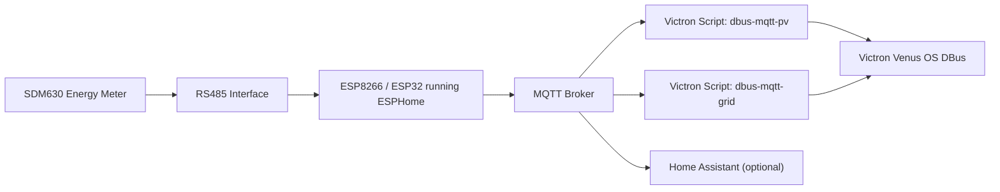

# SDM630 ESPHome MQTT Bridge for Victron and Home Assistant


A lightweight **ESPHome project** that reads an **Eastron SDM630 Modbus energy meter** over **RS485** and publishes Victron-compatible **MQTT JSON**.

This project was designed to work directly with the excellent Victron community integrations:

- https://github.com/mr-manuel/venus-os_dbus-mqtt-grid
- https://github.com/mr-manuel/venus-os_dbus-mqtt-pv

Those scripts convert MQTT messages into **Victron DBus devices** inside **Venus OS**, allowing custom meters to appear as native Victron devices.

This project provides the **MQTT side of that integration**.

It can also be used as a **standalone MQTT energy meter** for systems like **Home Assistant**.

---

# Table of Contents

- Overview
- Architecture
- Features
- Example JSON Output
- Hardware
- Wiring
- MQTT Topics
- Installation
- Diagnostics
- Customization
- Victron Integration
- Home Assistant Usage
- License

---

# Overview

This project runs on **ESP8266 or ESP32 using ESPHome** and reads an **SDM630 Modbus meter**.

Instead of polling every available Modbus register, it only reads the **minimum measurements required** to construct the JSON payload expected by the Victron MQTT scripts.

This approach:

- reduces Modbus traffic
- improves stability
- allows **1 second update intervals**
- keeps CPU usage low

---

# Architecture



The ESP device reads the SDM630 via **Modbus RTU**, builds the required JSON structure and publishes it to MQTT.

The Victron scripts then convert the MQTT message into a **virtual device on the Victron DBus**.

---

# Features

✔ Fast **1 second polling**  
✔ Minimal Modbus register usage  
✔ Compatible with **Victron dbus-mqtt-pv**  
✔ Compatible with **Victron dbus-mqtt-grid**  
✔ Works with **Home Assistant MQTT**  
✔ Optional diagnostics logging  
✔ RS485 watchdog monitoring  
✔ Simple configuration

---

# Example JSON Output

Example output in **PV mode**:

```json
{
  "pv": {
    "power": 5546,
    "current": 23.22,
    "energy_forward": 32926.346,
    "L1": {
      "power": 1843.7,
      "voltage": 237.9,
      "current": 7.75,
      "frequency": 49.94
    },
    "L2": {
      "power": 1853.6,
      "voltage": 239.8,
      "current": 7.73,
      "frequency": 49.94
    },
    "L3": {
      "power": 1841.2,
      "voltage": 238.2,
      "current": 7.73,
      "frequency": 49.94
    }
  }
}
```

---

# Hardware

Tested with:

- ESP8266 NodeMCU
- ESPHome
- TTL to RS485 module
- Eastron SDM630
- MQTT broker
- Victron Venus OS

ESP32 boards also work.

---

# Wiring

ESP8266 → RS485 module

```
ESP8266        RS485 Module
---------------------------
GPIO13  -----> DI
GPIO12  <----- RO
GPIO14  -----> DE
GPIO14  -----> RE
3.3V    -----> VCC
GND     -----> GND
```

RS485 module → SDM630

```
RS485 A -----> SDM630 A
RS485 B -----> SDM630 B
```

If communication does not work, try swapping **A and B**.

---

# MQTT Topics

Main JSON output:

```
victron/sdm630
```

Diagnostics topic:

```
victron/sdm630/debug
```

---

# Installation

1. Install ESPHome
2. Create a new device
3. Copy the YAML configuration from this repository
4. Adjust:
   - WiFi credentials
   - MQTT settings
   - GPIO pins
   - `victron_role`
5. Flash the ESP
6. Verify MQTT messages

---

# Diagnostics

Optional diagnostics can log:

- WiFi reconnect events
- MQTT reconnects
- RS485 communication health
- meter freshness watchdog

When disabled the device runs with minimal logging.

---

# Customization

Key configuration option:

```
victron_role: "pv"
```

or

```
victron_role: "grid"
```

Other adjustable parameters:

- MQTT topic
- UART pins
- update interval
- diagnostic logging

---

# Victron Integration

This project is designed to feed data into:

**MQTT → Victron DBus bridge scripts**

Repositories:

PV Meter  
https://github.com/mr-manuel/venus-os_dbus-mqtt-pv

Grid Meter  
https://github.com/mr-manuel/venus-os_dbus-mqtt-grid

These scripts convert the MQTT JSON into native **Victron devices** visible in:

- Venus OS
- GX devices
- VRM portal

---

# Home Assistant Usage

Even if you do not use Victron, this project still works great in Home Assistant:

- ESPHome sensors remain available
- MQTT JSON can be used in automations
- very fast Modbus polling
- low CPU load

---

# License

MIT License

Use, modify and share freely.
